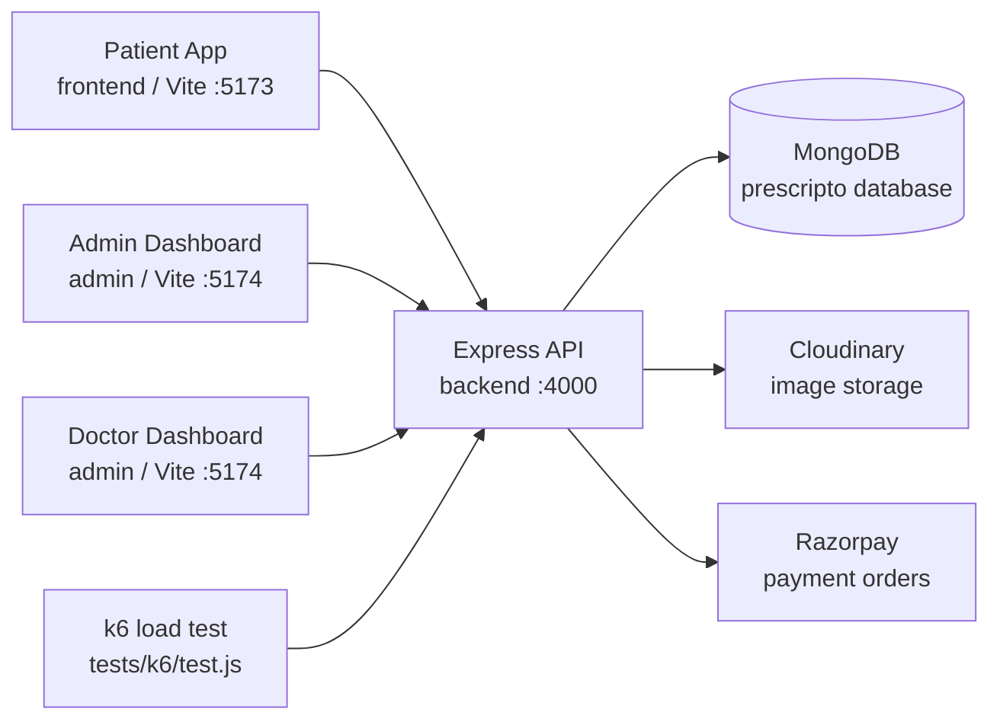

# 🩺 MyDoctor

<div align="center">


**A full-stack doctor appointment booking platform with separate patient, admin, doctor, and API services.**

</div>

---

## 📌 Overview

MyDoctor is implemented as a multi-service MERN-style appointment platform:

| App | Folder | Purpose |
| --- | --- | --- |
| 🧑‍⚕️ Patient Web App | `frontend/` | Browse doctors, register/login, manage profile, book appointments, pay online |
| 🛠️ Admin + Doctor Dashboard | `admin/` | Admin doctor onboarding and appointment oversight; doctor appointment/profile management |
| 🔌 Backend API | `backend/` | Authentication, doctors, users, appointments, image uploads, payments |
| 📈 Load Test | `tests/k6/` | k6 appointment-booking load scenario |

---

## 🧱 Tech Stack

| Layer | Actual Implementation |
| --- | --- |
| Frontend | React `19`, Vite `7`, React Router DOM `7`, Axios, React Toastify |
| Styling | Tailwind CSS `4`, custom primary color `#5f6FFF` |
| Admin dashboard | React `19`, Vite `7`, Tailwind CSS `4`, `tailwind-scrollbar-hide` |
| Backend | Node.js, Express `5`, ES modules, CORS, dotenv |
| Database | MongoDB through Mongoose `8` |
| Auth | JSON Web Tokens, bcrypt password hashing |
| File uploads | Multer disk storage, Cloudinary image upload |
| Payments | Razorpay order creation and order-status verification |
| Testing | k6 load test script |
| Containers | Dockerfiles for all three services, root Docker Compose file |

---

## ✨ Features

| Area | Features |
| --- | --- |
| 👤 Patient | Register, login, browse doctors, filter by speciality, view doctor details, book 30-minute slots, view appointments, cancel appointments, edit profile, upload profile image, pay with Razorpay |
| 🧑‍⚕️ Doctor | Login, view assigned appointments, mark appointments completed, cancel appointments, view dashboard metrics, view/update profile fees/address/availability |
| 🛡️ Admin | Login, add doctors with image upload, list doctors, toggle doctor availability, view all appointments, cancel appointments, view dashboard metrics |
| 💳 Payments | Backend creates Razorpay orders; frontend opens Razorpay checkout; backend verifies order status and marks appointments paid |
| 🖼️ Media | User and doctor images are uploaded to Cloudinary |

Implemented specialities in the UI:

| Speciality |
| --- |
| General physician |
| Gynecologist |
| Dermatologist |
| Pediatricians |
| Neurologist |
| Gastroenterologist |

---

## 🗺️ Architecture



<details>
<summary><strong>📁 Project Structure</strong></summary>

```text
.
├── admin/
│   ├── src/
│   │   ├── components/
│   │   ├── context/
│   │   └── pages/
│   │       ├── Admin/
│   │       └── Doctor/
│   ├── Dockerfile
│   ├── package.json
│   └── vite.config.js
├── backend/
│   ├── config/
│   ├── controllers/
│   ├── middlewares/
│   ├── models/
│   ├── routes/
│   ├── Dockerfile
│   ├── package.json
│   └── server.js
├── frontend/
│   ├── public/
│   ├── src/
│   │   ├── assets/
│   │   ├── components/
│   │   ├── context/
│   │   └── pages/
│   ├── Dockerfile
│   ├── package.json
│   └── vite.config.js
├── tests/
│   └── k6/
│       └── test.js
├── docker-compose.yml
└── README.md
```

</details>

---

## 🔌 API Endpoints

Base URL in local development:

```text
http://localhost:4000
```

Authentication uses custom headers in the checked-in clients:

| Role | Header |
| --- | --- |
| User | `token` |
| Admin | `aToken` |
| Doctor | `dToken` |

### 👤 User Routes

| Method | Endpoint | Auth | Controller Behavior |
| --- | --- | --- | --- |
| `POST` | `/api/user/register` | Public | Validates email/password, hashes password, creates user, returns JWT |
| `POST` | `/api/user/login` | Public | Validates credentials, returns JWT |
| `GET` | `/api/user/get-profile` | `token` | Returns user profile without password |
| `POST` | `/api/user/update-profile` | `token` | Updates profile fields and optional Cloudinary image |
| `POST` | `/api/user/book-appointment` | `token` | Books an available doctor slot and stores appointment snapshot |
| `GET` | `/api/user/appointments` | `token` | Lists appointments for the authenticated user |
| `POST` | `/api/user/cancel-appointment` | `token` | Cancels appointment and releases doctor slot |
| `POST` | `/api/user/payment-razorpay` | `token` | Creates a Razorpay order for an appointment |
| `POST` | `/api/user/verifyRazorpay` | `token` | Fetches Razorpay order status and marks appointment paid |

### 🧑‍⚕️ Doctor Routes

| Method | Endpoint | Auth | Controller Behavior |
| --- | --- | --- | --- |
| `GET` | `/api/doctor/list` | Public | Lists doctors without password/email |
| `POST` | `/api/doctor/login` | Public | Validates doctor credentials, returns JWT |
| `GET` | `/api/doctor/appointments` | `dToken` | Lists appointments assigned to doctor |
| `POST` | `/api/doctor/complete-appointment` | `dToken` | Marks an appointment completed |
| `POST` | `/api/doctor/cancel-appointment` | `dToken` | Cancels a doctor appointment |
| `GET` | `/api/doctor/dashboard` | `dToken` | Returns earnings, appointments, patients, latest appointments |
| `GET` | `/api/doctor/profile` | `dToken` | Returns doctor profile without password |
| `POST` | `/api/doctor/update-profile` | `dToken` | Updates fees, address, and availability |

### 🛡️ Admin Routes

| Method | Endpoint | Auth | Controller Behavior |
| --- | --- | --- | --- |
| `POST` | `/api/admin/login` | Public | Compares credentials with env vars, returns JWT |
| `POST` | `/api/admin/add-doctor` | `aToken` | Validates doctor data, uploads image, hashes password, creates doctor |
| `POST` | `/api/admin/all-doctors` | `aToken` | Lists all doctors without passwords |
| `POST` | `/api/admin/change-availability` | `aToken` | Toggles doctor availability |
| `GET` | `/api/admin/appointments` | `aToken` | Lists all appointments |
| `POST` | `/api/admin/cancel-appointment` | `aToken` | Cancels appointment and releases doctor slot |
| `GET` | `/api/admin/dashboard` | `aToken` | Returns doctor, patient, appointment, latest appointment counts |

---

## 🔐 Environment Variables

Create these files locally. The repository does not include committed `.env` files.

### `backend/.env`

| Variable | Required | Used By |
| --- | --- | --- |
| `PORT` | No | API port, defaults to `4000` |
| `MONGODB_URL` | Yes | MongoDB connection base URL; backend appends `/prescripto` |
| `JWT_SECRET` | Yes | User, admin, and doctor JWT signing/verification |
| `ADMIN_EMAIL` | Yes | Admin login |
| `ADMIN_PASSWORD` | Yes | Admin login |
| `CLOUDINARY_NAME` | Yes | Cloudinary config |
| `CLOUDINARY_API_KEY` | Yes | Cloudinary config |
| `CLOUDINARY_SECRET_KEY` | Yes | Cloudinary config |
| `RAZORPAY_KEY_ID` | Yes | Razorpay server-side instance |
| `RAZORPAY_KEY_SECRET` | Yes | Razorpay server-side instance |
| `CURRENCY` | Yes | Razorpay order currency |

```env
PORT=4000
MONGODB_URL=mongodb://localhost:27017
JWT_SECRET=replace-with-a-long-secret

ADMIN_EMAIL=admin@example.com
ADMIN_PASSWORD=replace-with-a-strong-password

CLOUDINARY_NAME=your-cloud-name
CLOUDINARY_API_KEY=your-api-key
CLOUDINARY_SECRET_KEY=your-secret-key

RAZORPAY_KEY_ID=your-razorpay-key-id
RAZORPAY_KEY_SECRET=your-razorpay-key-secret
CURRENCY=INR
```

### `frontend/.env`

| Variable | Required | Used By |
| --- | --- | --- |
| `VITE_BACKEND_URL` | Yes | Patient app API calls |
| `VITE_RAZORPAY_KEY_ID` | Yes for online payment UI | Razorpay Checkout key in `MyAppointments.jsx` |

```env
VITE_BACKEND_URL=http://localhost:4000
VITE_RAZORPAY_KEY_ID=your-razorpay-key-id
```

### `admin/.env`

| Variable | Required | Used By |
| --- | --- | --- |
| `VITE_BACKEND_URL` | Yes | Admin and doctor dashboard API calls |

```env
VITE_BACKEND_URL=http://localhost:4000
```

---

## ⚙️ Installation Steps

### 1. Clone and install dependencies

```bash
git clone <repository-url>
cd mydoctor

cd backend
npm install

cd ../frontend
npm install

cd ../admin
npm install
```

### 2. Add environment files

Create:

| File | Purpose |
| --- | --- |
| `backend/.env` | Backend secrets and service keys |
| `frontend/.env` | Patient app API and Razorpay browser key |
| `admin/.env` | Dashboard API URL |

### 3. Run the backend

```bash
cd backend
npm run server
```

Health check:

```text
GET http://localhost:4000/
```

### 4. Run the patient app

```bash
cd frontend
npm run dev
```

Default Vite port:

```text
http://localhost:5173
```

### 5. Run the admin/doctor dashboard

```bash
cd admin
npm run dev
```

Default Vite port:

```text
http://localhost:5174
```

---

## 📦 Available Scripts

| App | Command | Description |
| --- | --- | --- |
| Backend | `npm start` | Starts `server.js` with Node |
| Backend | `npm run server` | Starts `server.js` with Nodemon |
| Backend | `npm test` | Placeholder script that exits with an error |
| Frontend | `npm run dev` | Starts Vite dev server on `5173` |
| Frontend | `npm run build` | Builds patient app |
| Frontend | `npm run preview` | Serves built patient app preview |
| Frontend | `npm run lint` | Runs ESLint |
| Admin | `npm run dev` | Starts Vite dev server on `5174` |
| Admin | `npm run build` | Builds dashboard app |
| Admin | `npm run preview` | Serves built dashboard preview |
| Admin | `npm run lint` | Runs ESLint |

---

## 🐳 Docker Setup

The repository includes:

| File | Service |
| --- | --- |
| `backend/Dockerfile` | Node 22 Alpine backend, exposes `4000`, runs `npm start` |
| `frontend/Dockerfile` | Node 22 Alpine Vite app, exposes `5173`, runs `npm run dev -- --host` |
| `admin/Dockerfile` | Node 22 Alpine Vite app, exposes `5174`, runs `npm run dev -- --host` |
| `docker-compose.yml` | Builds all three services |

Run:

```bash
docker compose up --build
```

Stop:

```bash
docker compose down
```

Compose ports currently configured:

| Service | Compose Mapping |
| --- | --- |
| Backend | `4000:4000` |
| Frontend | `5173:5173` |
| Admin | `5174:5173` |

> ⚠️ The checked-in `admin/vite.config.js` uses port `5174`, and `admin/Dockerfile` exposes `5174`, but `docker-compose.yml` maps host `5174` to container `5173`. As implemented, this mapping should be reviewed before relying on the admin container.

`docker-compose.yml` loads `./backend/.env` for the backend service. The frontend and admin services also require Vite environment variables, but the compose file does not currently pass them.

---

## 🚀 Deployment Details

The project contains Dockerfiles and production build scripts, but no platform-specific deployment config such as Render, Vercel, Netlify, Railway, or GitHub Actions workflow files.

Deployment-ready pieces currently present:

| Piece | Status |
| --- | --- |
| Backend start command | `npm start` in `backend/package.json` |
| Frontend build command | `npm run build` in `frontend/package.json` |
| Admin build command | `npm run build` in `admin/package.json` |
| Dockerfiles | Present for backend, frontend, and admin |
| Docker Compose | Present at repository root |
| Hosted URL reference | `tests/k6/test.js` targets `https://prescripto-backend-ikxu.onrender.com` |

Recommended deployment mapping based on the actual apps:

| Service | Build / Start |
| --- | --- |
| Backend API | Install in `backend/`, set backend env vars, run `npm start` |
| Patient frontend | Install in `frontend/`, set `VITE_BACKEND_URL` and `VITE_RAZORPAY_KEY_ID`, run `npm run build`, serve `dist/` |
| Admin dashboard | Install in `admin/`, set `VITE_BACKEND_URL`, run `npm run build`, serve `dist/` |

---

## 📈 Load Testing

A k6 scenario exists at:

```text
tests/k6/test.js
```

It runs:

| Setting | Value |
| --- | --- |
| Virtual users | `500` |
| Duration | `5m` |
| Request | `POST /api/user/book-appointment` |
| Target URL in file | `https://prescripto-backend-ikxu.onrender.com/api/user/book-appointment` |

Run:

```bash
k6 run tests/k6/test.js
```

<details>
<summary><strong>⚠️ Load test note</strong></summary>

The load test contains hard-coded token, doctor ID, user ID, and hosted URL values. Replace them with dedicated test-environment values before running.

</details>

---

## 🧬 Data Models

| Model | Main Fields |
| --- | --- |
| `user` | `name`, `email`, `password`, `image`, `address`, `gender`, `dob`, `phone` |
| `doctor` | `name`, `email`, `password`, `image`, `speciality`, `degree`, `experience`, `about`, `available`, `fees`, `address`, `date`, `slots_booked` |
| `appointment` | `userId`, `docId`, `slotDate`, `slotTime`, `userData`, `docData`, `amount`, `date`, `cancelled`, `payment`, `isCompleted` |

---

## 🧭 App Routes

### Patient App

| Route | Page |
| --- | --- |
| `/` | Home |
| `/doctors` | Doctor listing |
| `/doctors/:speciality` | Filtered doctor listing |
| `/login` | User login/sign up |
| `/about` | About |
| `/contact` | Contact |
| `/my-profile` | User profile |
| `/my-appointments` | User appointments and payments |
| `/appointment/:docId` | Doctor appointment booking |

### Admin + Doctor Dashboard

| Route | Page |
| --- | --- |
| `/admin-dashboard` | Admin dashboard |
| `/all-appointments` | Admin appointments |
| `/add-doctor` | Add doctor |
| `/doctor-list` | Doctor list |
| `/doctor-dashboard` | Doctor dashboard |
| `/doctor-appointments` | Doctor appointments |
| `/doctor-profile` | Doctor profile |

---

## 🛡️ Security Notes From Implementation

<details>
<summary><strong>Authentication behavior</strong></summary>

- User and doctor JWTs store the MongoDB document ID as `id`.
- Admin JWT signs the concatenated `ADMIN_EMAIL + ADMIN_PASSWORD` string.
- Middleware injects `userId` or `docId` into `req.body`.
- Role tokens are read from custom headers, not the standard `Authorization: Bearer` header.

</details>

<details>
<summary><strong>Operational considerations</strong></summary>

- CORS is currently enabled globally with default settings.
- Multer stores uploaded files using the original filename before Cloudinary upload.
- Razorpay verification checks fetched order status and marks payment when status is `paid`.
- There is no committed automated unit/integration test suite; the backend `npm test` script is a placeholder.

</details>

---

## 🧯 Troubleshooting

| Problem | Check |
| --- | --- |
| Backend cannot connect to MongoDB | Confirm `MONGODB_URL`; backend appends `/prescripto` |
| Patient/admin app cannot call API | Confirm `VITE_BACKEND_URL` and restart Vite |
| Profile or doctor image upload fails | Confirm Cloudinary env vars |
| Admin login fails | Confirm `ADMIN_EMAIL` and `ADMIN_PASSWORD` in `backend/.env` |
| Razorpay checkout fails in browser | Confirm `frontend/.env` has `VITE_RAZORPAY_KEY_ID` |
| Razorpay order creation fails | Confirm backend Razorpay keys and `CURRENCY` |
| Admin Docker service is unreachable | Review the `5174:5173` compose mapping against admin Vite port `5174` |

---

## 📄 License

The backend package declares the license as `ISC` in `backend/package.json`. The frontend and admin packages do not declare a license field.
